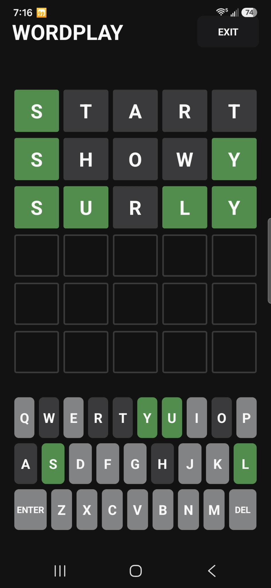
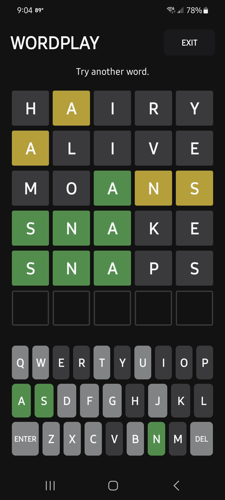
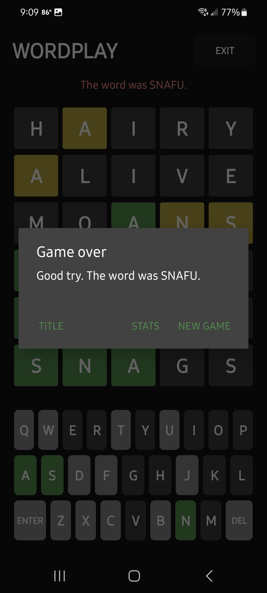

# WordPlay

Players try to guess a hidden five-letter word within a limited number of attempts. After each guess, the game gives tile feedback to show which letters are correct, misplaced, or not in the word.

## Features

* Five-letter word guessing gameplay
* Limited number of attempts
* On-screen keyboard input
* Color-coded tile feedback
* Win/loss game state handling
* Clean Android UI
* Replay/new game support
* Lightweight and beginner-friendly codebase

## Gameplay

The goal is to guess the hidden word before running out of attempts.

After each guess:

* Correct letters in the correct position are marked as correct
* Correct letters in the wrong position are marked as misplaced
* Letters not found in the word are marked as incorrect

## Screenshots

## Tech Stack

* Android
* Kotlin
* Jetpack Compose
* Android Studio

## Acknowledgments

Inspired by the popular word guessing format of Wordle. This project was created for educational and practice purposes only.  
This project is not affiliated with, endorsed by, or connected to The New York Times or the official Wordle game.

